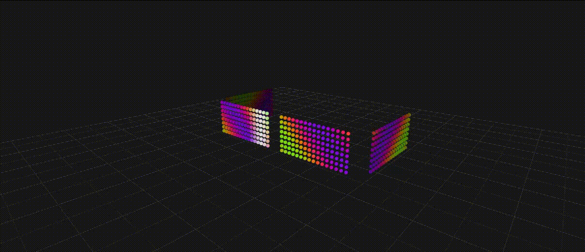

# Position-Based LED Rendering Engine

This is a position-based LED rendering engine designed specifically for Arduino Nano IoT ESP32 wearable projects, like LED glasses. Unlike traditional grid-based rendering engines, this engine uses 3d space, allowing you to map LEDs anywhere and apply effects that flow naturally across complex shapes.



---

## Features

- **3D Spatial Mapping:** Map your LEDs in a virtual 3D coordinate system. No more messy 2D index translations.
- **Effect Layers:** Layer multiple effects with built-in blending modes.
- **Desktop Emulator:** Develop and test your effects on your PC using the SDL3-based emulator before event to have working hardware.
- **Flexible Pixel Mapping:** Built-in support for mapping matrices (with zig-zag), lines, and individual pixels into 3D space. The emulator can also render the solder order of your hardware project.

## TODO
- [ ] Add a LED library for hardware support.
- [ ] Add font support for text scrolling, for example.
- [ ] Add IMGUI for better debugging and emulator control.
- [ ] Add support for bluetooth connection to change effects remotely.
- [ ] Add noise functions.
- [ ] Add texture support.
- [ ] Add a particle system.

---

## Project Structure

- `lib/led_engine`: The core rendering logic, math, and effect system.
- `lib/emulator`: SDL3 and OpenGL-based desktop visualization tool.
- `src/main.cpp`: Entry point for both ESP32 hardware and the Emulator.
- `src/effects`: All effect layers.

---

## Getting Started

### Prerequisites

- **[PlatformIO](https://platformio.org/)** (CLion, VS Code extension, or CLI)
- **SDL3** (For the emulator)
  - **Linux:** `sudo apt install libsdl3-dev`
    - **Arch Linux:** `sudo pacman -S sdl3`
    - **Ubuntu debian based (Not tested):** `sudo apt install libsdl3-dev`
  - **Windows:** Install `sdl3` via `vcpkg` and set `VCPKG_ROOT`.
  - **macOS (Not tested):** `brew install sdl3`

### Build & Run

- **Emulator:** `pio run -e emulator -t exec`
- **Arduino Nano IoT ESP32:** `pio run -e arduino_nano_esp32 -t upload`
> Note: For hardware projects you need to manually map the output of the renderer to a led library. This has not been implemented yet but will be in the future.
---

## Creating a Custom Effect

Creating an effect is as simple as inheriting from the `Effect` class and implementing `onUpdate`.

```cpp
class MyCoolEffect : public Effect {
public:
    void onUpdate(float dt, float elapsed, const Pixel* pixels, Color* colors, size_t count) override {
        for (size_t i = 0; i < count; ++i) {
            const Point& pos = pixels[i].position;
            
            // Create a wave that moves along the X and Z axis
            float intensity = std::sin(pos.x * 0.5f + elapsed * 2.0f) * 
                             std::cos(pos.z * 0.5f + elapsed * 1.5f);
            
            colors[i] = Color(intensity * 255, 0, 255); // Neon Purple!
        }
    }
};
```

---

## Pixel Mapping

Map your hardware layout into the 3D world. You can map multiple panels, strips, or custom shapes.

```cpp
void setup() {
    auto mapper = PixelMapper(gPixels, PIXEL_COUNT);

    // Map a 16x8 matrix panel at (0, 0, 0)
    mapper.mapMatrix(
        Point(0, 0, 0),    // Start position
        16, 8,              // Cols, Rows
        Point::Right(),    // Column direction
        Point::Down(),     // Row direction
        Point::Forward()   // Normal
    );
    
    // Add another strip on a different side
    mapper.setLedStrip(2);
    mapper.mapLine(Point(10, 0, 5), Point::Up(), 30);
}
```


---

## Contributing

Got a cool effect or a feature idea? Contributions are welcome!
1. Fork the repo.
2. Create your branch (`git checkout -b feature/CoolEffect`).
3. Commit your changes.
4. Push to the branch.
5. Open a Pull Request.

---

## License

This project is licensed under The Unlicense. See the UNLICENSE file for details.
